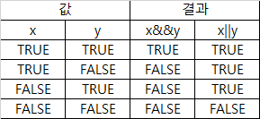
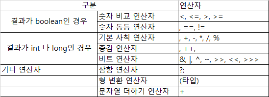
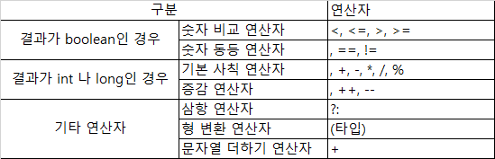
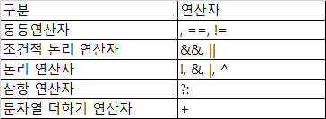
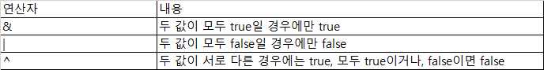

##5장
* 계산을 위한 산술 연산자는 기본 자료형 중에서 boolean만 사용 할 수 있다
  * 참조 자료형 중 +는 String만 사용 할 수 있다
* = (대입 연산자, assignment operaotr)
* +, - 수학에서 쓰고 있는 연산과 같다
* %는 나머지를 뜻한다
```java
public class Oper ators {
  public static void main(String[] args) {
    Operators sample = new Operators();
    sample.additive();
  }
  
  public void addtive(){
      int intValue1=5;
      int intValue2=10;
      
      int result = intValue1 + intValue2;
      System.out.println(reuslt); // 1 -> 15
      reulst = intValue2 - intValue1;
      System.out.println(result); //2 -> 5
  }
  
  public void multiplicative(){
    int intValue1=5;
    int intValue2=10;

    int result = intValue1 * intValue2;
    System.out.println(reuslt); //3 -> 50
    reulst = intValue2 / intValue1;
    System.out.println(result); //4 -> 2
    result = intValue1 / intValue2;
    System.out.println(result); //5 -> 0
    float result2 = (float) intValue1 / intValue2;
    System.out.println(result2); // 6 -> 0.5
  }

  public void remainder(){
    int intValue1=53;
    int intValue2=10;

    int result = intValue1 % intValue2;
    System.out.println(reuslt); //7 -->3
    int result = 50 % intValue2;
    System.out.println(reuslt); //8 -->0
  }
}
```

* 1번째에 할당 되었던 result값이 2번째에 새롭게 할당돼어 더하기 결과가 사라지고 새로운 결과가 result변수에 할당된다
* 5번째에 값이 0이 나온 이유는 result가 정수타입이기 때문이다.
  * 자바에서 계산하는 두 값이 정수형이더라도 결과가 소수형으로 값이 안나온다
* 7번째에 53/10을 하면 정수부분의 결과는 5이고 나머지 값은 3이기 때문이다
  * 나머지값이 없으면 0으로 나온다
  * %을 통해서 100이 3의배수인지 확인을 할 수 있다

***
### 간단하게 계산하는 대입 연산자들
```java
int intValue1 = 10;
intValue1 = intValue1 + 5;

int intValue1 = 10;
intValue1 += 5; //* intValue1에 5를 더한것을 intValue1에 할당해라
```
* intValue1의 값은 원래 10이지만 5를 더해서 15가 된다
* + 와 = 사이에 공백이 있으면 안되고 두 기호를 붙여써야된다
  * += : 기존 값에 우측 항의 값을 더함 ex) intValue1 += 5; --> 15
  * -= : 기존 값에 우측 항의 값을 뺌 ex) intValue1 -= 5; --> 5
  * *= : 기존 값에 우측 항의 값을 곱함 ex) intValue1 *= 5; --> 50
  * /= : 기존 값에 우측 항의 값을 나눔 ex) intValue1 /= 5; --> 2
  * %= : 기존 값에 우측 항의 값의 나머지 ex) intValue1 %= 5; --> 0

```java
public static void main(String[]args){
        int intValue1  = 10;
        System.out.println(intValue1 += 5); //15
        System.out.println(intValue1 -= 5); //10
        System.out.println(intValue1 *= 5);//50
        System.out.println(intValue1 /= 5);//10
        System.out.println(intValue1 %= 5);//0
        
        }
```
***
### 단항연상자
* 위에 +,-,/,*,%는 모두 두개의 피연산자를 사용한다 즉 1+2, 1-2 와 같이 1과 2의 두개의 값을 갖고 처리한다
* **한개**만 존재하는 피연산자를 **단항 연산자**라고 한다
  * +: 단항 플러스 연산자
  * -: 단항 마이너스 연산자
  * ++ : 증가 연산자
  * -- : 감소 연산자
  * ! : 논리 부정 연산자
***
### +& - 
```java
public class Operators{
    public void unary(){
        int intValue= -10;
        int result = +intValue; // -10
      System.out.println(result);
      result = -intValue; // 10
      System.out.println(result);
    }
}
```
* 두개의 숫자나 변수를 비교하는 것이 아니라 단 하나의 숫자나 변수 앞에 + - 를 붙이면 단항 연산자로 처리된다
   * +는 변수 * (1) 을 의미
   * -는 변수 * (-1)을 의미
***
### ++증감연산자 --감소연산자
* ++ 와 --도 공백이 있으며 안되고 두개를 반드시 붙여야 된다
* 다른 단항 연산자와 다르게 변수 앞에 붙을 수도 있고 뒤에 붙을 수 도 있다 ex) a++ , --a 
* = 없이 숫자가 아닌 변수에만 연산자들을 사용 할 수 있다 ex ) ++5(X) 
* 피연산자를 1씩 증가 혹은 감소를 시킨다
```java
public class Operators{
    public void increDecre(){
      int intValue= 1;
      System.out.println(intValue++);
      System.out.println(intValue);
      System.out.println(++intValue);
      
      int intValue2 = 1;
      System.out.println(intValue2);
      intValue2 = intValue2+1;
      System.out.println(intValue2);
      intValue2 = intValue2+1;
      System.out.println(intValue2);
    }
}
```
* 1번째는 결과를 출력한 후에 1을 더하고
* 2번째는 값만 출력
* 3번째는 출력문을 수행하기 전에 1을 더해 결과를 출력한다
  * ++변수 는 변수값을 +1을 시킨 후 그 값을 사용 
  * 변수++ 는 변수값을 먼저 사용 한 다음 +1 증가
***
### ! 논리 부정 연산자
* !연산자는 boolean타입 에서만 연산자를 사용 할 수 있다 
* boolean은 true와 false 밖에 없어 boolean앞에 값을 붙여주면 그 결과가 반대로 나온다
```java
public class Operators{
    public void complement(){
    boolean flag = true;
      System.out.println(flag); // true
      System.out.println(!flag); // false
    }
}
```
***
### 연산 순서
* 수학과 마찬가지로 자바에서도 괄호먼저 계산을 한다  

| 제목     |         내용         | 우선순위 |
|:------:|:------------------:|:--------:|
| 단항연산자  | ++, --, +, -, !, ~ |  1   |
| 산술연산자  |     = *, /, %      |  2   |
| 산술연산자  |        +, -        |  3   |

* ~(틸드) 2진수로 되어있는 비트(bit) 값을 전부 거꾸로 바꾸는데 사용한다 
   * !은 boolean에서만 사용 할 수 있다면 ~는 비트의 값을 0을 1로 1을 0으로 바꾸는데사용한다
*  연산 우선수위가 있더라도 **괄호로** 묶은 것보다는 우선순위가 높지 않다
****
### 비교연산자
* == : 같음(equal to)  
* != : 같지 않음(not equal to)
* .> : 왼쪽 값이 큼 (greater then)
* .>= : 왼쪽 값이 크거나 같음 (greater then or equal to)
* <  : 왼쪽 값이 작음 (less then)
* <= : 왼쪽 값이 작거나 같음 (less then or equal to)
```java
public static void main(String[]args){
    int equal  = 1;
    System.out.println(equal == 1); // true
    System.out.println(equal != 2); // true
    System.out.println(equal > 0); // true
    System.out.println(equal >= 1); // true
    System.out.println(equal < 2); // true
    System.out.println(equal <= 1); // true
        }
```
* 연산자들은 왼쪽과 오른쪽에 각각 비교할 값들이 있어야만 비교할 수 있다
* 모든 비교 연산자의 결과는 반드시 boolean이고 조건이 맞으면 true 틀리면 false다
***

### == & != 등가 비교 연산자
* 두 개의 값이 같은지 다른지를 확인 할 때 사용 한다
* 결과는 무조건 boolean 타입이다
```java
public static void main(String[]args){
    int value1  = 1;
    int value2  = 2;
    int value3  = 1;
    System.out.println(value1 == value2); // false
    System.out.println(value1 == value3); // true
        
    System.out.println(value1 != value2); // true
    System.out.println(value1 != value3); // false

        }
```
* ==는 두개의 값이 같으면 true
* !=는 두개의 값이 다르면 true
* 등가 비교 연산자는 모든 타입에서 사용할 수 있다
  * 모든 기본 자료형과 참조자료형에서도 쓸 수 있다
  * 기본 자료형은 같은 종류끼리 비교가 가능하다 char == int , boolean == boolean ...
  * 참조 자료형은 그 주소 값이 같은지 확인한다
  
```java
public static void main(String[]args){
    char charValue = 'a';
    System.out.println(97 == charValue); // true
    double doubleValue = 1.0;
    int value  = 1;
    System.out.println(doubleValue == value); //true

        }
```

* 'a'의 값은 97이여서 true고 숫자끼리 비교할 수 있는 것을 알 수 있다
* double 1.0과 int 1 도 같은 값이여서 true이다

***
### 대소 비교 연산자
|   식    |       true 조건       |
|:------:|:-------------------:|
| a < b  |    a가 b 보다 작을 때     | 
| a > b  |     a가 b 보다 클 때     | 
| a <= b | a가 b 보다  작거나 같을 때 | 
| a >= b |  a가 b 보다 크거나 같을 때   | 

* 대소 비교 연산자라고 불리며 boolean 타입 이다
* .>= <= 는 순서를 지켜야 된다 

```java
public static void main(String[]args){
    int value = 1;
    int value2 = 2;
    System.out.println(value1 > value2); // false
    System.out.println(value1 < value2); //true 
    System.out.println(value1 <= value2); //true
    System.out.println(value1 >= value2); // false
       }
```

|     연산자      |      사용 가능한 타입      |
|:------------:|:-------------------:|
|    ==, !=    |   모든 타입 (기본, 참조)    | 
| >, <, >=, <= | boolean을 제외한 기본 자료형 | 

***

### 논리연산자


* and 결합은 조건이 모두 true일 때 true로 만 처리된다
* or결합은 둘 중 하나라도 true이면 true로 처리 된다

```java
public static void main(String[]args){
    boolean x = true;
    boolean y = true;
    System.out.println(x && y); // true
    System.out.println(x || y); // true
    
    x = false;
    System.out.println(x && y); // false
    System.out.println(x || y); //true

    y = false;
    System.out.println(x && y); // false
    System.out.println(x || y); // false

       }
```
******

### 삼항 연산자
> 변수 1번 = (boolean조건식) 2번 ? true일때 값 3번: false일때 값 4번
```java
public class Operators{
  public boolean blindData(int point){

      boolean bliand = false;
      
      bliand = (point >= 80) ? true : false;
      
      return bliand = (point >= 80) ? true : false;
  }

  public static void main(String[] args) {
    Operators operators = new Operators();
    
    operators.blindData(30); // false;
    operators.blindData(80); // true;
      
  }
}
```
* 어떤 변수에 값을 할당할 때 조건이 있는 문장을 처리 할 수 있다
***

### 기본 자료형의 형변환
* 형 변환은 영어로 캐스팅(casting)이라고 한다
* 자바의 형 변환은 기본 자료형과 참조 자료형 모두 괄호로 묶어주면 된다
* boolean타입은 형 변환이 불가능 하다 숫자로 변환할 수 없기 때문이다 
* 기본자료형 -> 참조자료형, 참조자료형 -> 기본자료형으로는 형 변환이 안된다

---
  * byte 타입으로 할당한 별수를 short 타입의 변수로 지정하고 싶을 때 (1바이트에서 2바이트로 커지는 캐스팅) 
     * 크기가 커지는 캐스팅은 별도로 해줄 것 이 없다
  * short 타입으로 할당한 변수를 byte타입의 변수로 지정하고 싶을 때 (2바이트에서 1바이트로 작아지는 캐스팅)
```java
public class Operators{
    
  public void casting(){
      byte byteValue = 127; //1
      short shortValue = byteValue; //2
    
    shortValue++; //3
    System.out.println(shortValue);
    byteValue = (byte) shortValue; //4
    System.out.println(byteValue);
  }
  
}
```

1. byteValue에는 byte의 최대값인 127을 할당했다
2. byte 값을 shortValue라는 변수에 할당했다
   * 범위가 작은 타입에서 범위가 큰 타입으로 변환할 때에는 별도로 명시하지 않아도 형 변환이 이루어 진다.
   * 즉 bsil(비실) fd 순서로 형변환을 할 때 아무런 문제가 없이 가능하다
3. shortValue에 1을 더하고 출력 했을 때 byte의 최대값은 넘어가지만 short의 최대값은 넘어가지 않는다
4. byteValue 변수에는 byte의 최대값보다 1이 많은 shortValue를 할당했다.
   * 범위가 큰 타입에서 범위가 작은 타입으로 변환할 때 소괄호 안에 범위가 작은 작은 타입을 명시해줘야 된다
   * 캐스팅을 안해주면 컴파일이 안된다

***
### 타입별 가능한 연산자
* 자바의 연산자들은 타입별로 사용 가능한 연산자가 정해져 있다
  * 크게 나누면 정수, 소수, boolean, 참조자료형 별로 사용 가능한 연산자가 각각 존재

#### 정수형에서 사용할 수 있는 연산자  

* 정수형 타입의 연산을 할 때에는 자바에서 제공할 수 있는 연산자를 다 사용 할 수 있다


#### 소수형에서 사용할 수 있는 연산자 

* double과 float는 소수형이기 때문에 비트 연산이 불가능 하다

#### boolean타입의 연산자

* !, &, |, ^의 연산자들은 boolean타입 사이에 사용하면 비트연산자와 같지만 결과는 boolean타입으로 제공한다

* &&와 &, ||와 |가 같아 보이지만 연산할 때는 다르다
   * &&의 경우 좌측에 있는 연산이 false이면  우측에 있는 연산을 하지 않는다
   * &는 좌측 연산 결과와 우측 연산 결과를 비교해야만 하기 때문에 모든 연산을 수행한다
   * if((a==3) && (b==1)) 일때 a==3이 false이면 우측에 있는 것을 비교수행 하지 않는다


