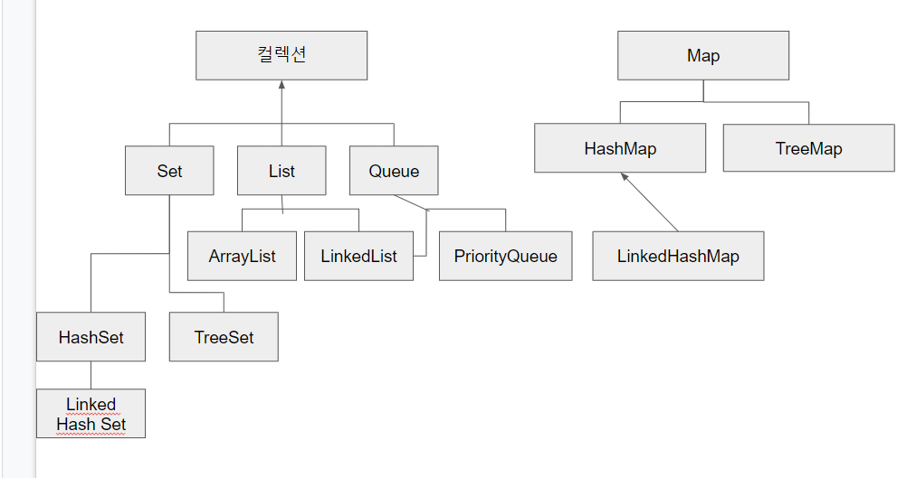

# 22장
## 자바랭 다음으로  많이 쓰는 애들은 컬렉션 - Part1( List )
### 자바 컬렉션
- 자바에서 컬렉션은 목록성 데이터를 처리하는 자료 구조를 통칭한다.
  - 자료 구조 ?
    - Data Structure
    - 어떤 정보를 담는 것을 의미한다.
    - 하나의 데이터가 아닌 여러 데이터를 담을 때 사용.
    - 배열이 가장 기본적인 자료 구조
      - DTO도 자료를 담는 한 방식
      - 순서가 있는 목록 List 형
      - 순서가 중요하지 않는 셋 Set 형
      - 먼저 들어온 것이 먼저 나가는 큐 Queue 형
      - 키 - 값 key- Value로 저장되는 Map 형
  - 자바에서는 목록 (List)와 셋(Set), 큐(Queue)는 Collection 이라는 인터페이스를 구현하고 있다.
    - Collection 인터페이스는 java.util 패키지에 선언되어 있다.
    - 여러 개의 객체를 하나의 객체에 담아 처리할 때 공통적으로 사용되는 여러 메서드들을 선언해 놓았다.
  - Map 은 Collection과 관련 없는 별도의 인터페이스로 선언되어 있다.


- 컬렉션 인터페이스는 다음과 같이 선언 되어 있다.
```java
public interface Collection<E> extends Iterable<E>
```

|리턴타입|메서드 이름 및 매개변수|
|------|-------------------|
|Iterator|iterator()|
- iterator()라는 메서드만 Iterable 인터페이스에 선언되어 있고, 이 메서드는 Iterator라는 인터페이스를 리턴한다.
> Iterator라는 인터페이스에는 추가 데이터가 있는지 확인하는 hasNext() 메서드, 현재 위치를 다음 요소로 넘기고 그 값을 리턴해주는 next()라는 메서드, 데이터를 삭제하는 remove() 메서드가 있다.
---------------------------
- Collection 인터페이스가 Iterable 인터페이스를 확장했다느 의미는, Iterator 인터페이스를 사용하여 데이터를 순차적으로 가져올 수 있다는 의미이다.
- 이제 Collection 인터페이스에 선언된 주요 메서드들의 목록을 살펴보자, 참고로 이 표의 내용에서 "요소" 라는 것은 영어로 `Element`이며, 컬렉션에 저장되는 각각의 데이터를 말한다.

|리턴타입| 메서드 이름 및 매개 변수          |설명|
|------|-------------------------|---|
|boolean| add(E e)                |요소를 추가한다.|
|boolean| addAll(Collection)      | 매개 변수로 넘어온 컬렉션의 모든 요소를 추가한다.|
|void | clear()                 | 컬렉션에 있는 모든 요소 데이터를 지운다.|
|boolean| contains(Object)        | 매개 변수로 넘어온 객체가 해당 컬렉션에 있는지 확인한다. 동일한 값이 있으면 true를 리턴한다.|
|boolean| containsAll(Collection) |매개 변수로 넘어온 객체들이 해당 컬렉션에 있는지 확인한다. 매개 변수로 넘어온 컬렉션에 있는 요소들과 동일 한 값들이 모두 있음녀 true를 리턴한다.|
|boolean| equals(Object)          |매개 변수로 넘어온 객체와 같은 객체인지 확인힌다.|
|int| hashCode()              | 해시 코드 값을 리턴한다.|
|boolean | isEmpty()               |컬렉션이 비어있는지 확인한다. 비어있으면 true를 리턴한다.|
|Iterator| iterator()              | 데이터를 한 건씩 처리하기 위한 Iterator 객체를 리턴한다.|
|boolean| remove (Object)|  매개 변수와 동일한 객체를 삭제한다.|
|boolean|removeAll(Collection)|매개 변수로 넘어온 객체들을 해당 컬렉션에서 삭제한다.|
|boolean|retainAll(Collection)|매개 변수로 넘어온 객체들만을 컬렉션에  남겨 둔다.|
|int |size()|요소의 개수를 리턴한다.|
|Obejct[]| toArray() | 컬렉션에 있는 데이터들을 배열로 복사한다.|
|<T> T[]|toArray(T[])| 컬렉션에 있는 데이터들을 지정한 타입의 배열로 복사한다.|

### List 인터페이스와 그 동생들
- 배열과 비슷한 목록에 대해서 알아보자. 
- 목록은 List 인터페이스로부터 시작되며, 이 List 인터페이스는 방금 배운 Collection 인터페이스를 확장하였다.  
따라서 몇몇 추가된 메서드를 제외하고는 Collection에 선언된 메서드와 큰 차이는 없다. Collection을 확장한 다른 인터페이스와 List 인터페이스의 가장 큰차이점은 배열처럼 순서가 있다는 것이다.
- List 인터페이스를 구현한 클래스들은 매우 많다. 그 많은 클래스들 중에서 `java.util' 패키지에서는 ArrayList, Vector, Stack, LinkedList를 많이 사용한다.
  - Vector와 ArrayList 클래스의 사용법은 거의 동일하고 기능도 비슷하다.
  - 확장 가능한 배열이다.
  - ArrayList 의 객체는 여러 명이 달려들어 값을 변경하려고 하면 문제가 발생할 수 있다.
  - Vector는 그렇지 않다는 것 이다.
  - ArrayList는 `Thread safe` 하지 않고. 
  - Vector는 `Thread Safe` 하다.
  
### ArrayList에 대해서 파헤쳐보자.

```java
java.lang.Obejct
- java.util.AbstractCollection<E>
    - java.util.AbstactList<E>
     - java.util.ArrayList<E>
```

- ArrayList의 가장 상위 부모는 `Object` 클래스다.
- 다음에는 Abstract Collection, AbstractList의 순으로 확장 했다.
- `Object`를 제외한 나머지 부모 클래스들의 이름 앞에는 `Abstract`이 붙어있다.
  - AbstractCollection은 Collection 인터페이스 중 일부 공통적인 메서드를 구현해 놓은 것이며, AbstractCollection은 Collection 인터페이스 중 일부 공통적인 메서드를 구현해 놓은 것이며,  
  AbstractList 는 List 인터페이스 중 일부 공통적인 메서드를 구현해 놓은 것이라고 기억하고 있으면 된다.
- ArrayList가 구현한 모든 인터페이스들은 다음과 같다.
  - `Serializable`, `Cloneable`, `Iterable<E>`, `Collection<E>`, `List<E>`, `RandomAccess`

|인터페이스|용도|
|--------|---|
|Serializable|원격으로 객체를 전송하거나, 파일에 저장할 수 있음을 지정|
|Cloneable|Object 클래스의 clone () 메서드가 제대로 수행될 수 있음을 지정. 즉, 복제가 가능한 객체임을 으미힌다.|
|Iteraable<E>|객체가 "foreach" 문장을 사용할 수 있음을 지정|
|Collection<E>|여러 개의 객체를 하나의 객체에 담아 처리할 때의 메서드 지정|
|List<E>|목록형 데이터를 처리하는 것과 관련된 메서드 지정|
|RandomAccess|목록형 데이터에 보다 빠르게 접근할 수 있도록 임의(random하게) 접근하는 알고리즘이 적용된 다는 것을 지정.|


### ArrayList의 생성자는 3개다.
|생성자|설명|
|----|----|
|ArrayList()|객체를 저장할 공간이 10개인 ArrayList를 만든다.|
|ArrayList(Collection<? extends E> c) | 매개 변수로 넘어온 컬렉션 객체가 저장되어 있는 ArrayList를 만든다.|
|ArrayList(int initialCapacity)| 매개 변수로 넘어온 initialCapacity 개수 만큼의 저장 공간을 갖는 ArrayList를 만든다.|

> Shallow Copy / Deep Copy
> list2 = list 와 같이 다른 객체에 원본 객체의 주소 값만을 할당하는 것은 Shallow copy이다.
> 객체의 모든 값을 복사하여 복제된 객체에 있는 값을 변경해도 원본에 영향이 없도록 할 때는 Deep copy를 수행한다.
> 예를 들어 배열을 복사할 때 System 클래스에 있는 arraycopy()와 같은 메서드를 이용하면 Deep copy를 쉽게 처리할 수 있다.

- 따라서 하나의 Collection 관련 객체를 복사할 일이 있을 때에는 이와 같이 생성자를 사용하거나, addAll() 메서드를 사용할 것을 권장한다.
- indexOf () 와 lastIndexOf() 메서드가 있는이유
  - ArrayList는 중복된 데이터를 넣을 수 있따.  0 번쨰에 `이상민`이라는 값을 넣고, 1번쨰에도 `이상민`이라는 값을 넣을 수 있다.
  - 앞에서부터 찾을 때에는 `indexOf()`를 뒤에서부터 찾을 때는 `lastIndexOf()`를 사용하면 된다.
  - 근데 간혹 ArrayList 객체에 있는 데이터들을 배열로 뽑아낼 필요도 있다. 그럴 대에는 toArray() 메서드 사용.

|리턴 타입|메서드 이름 및 매개 변수|설명|
|-------|---------------------|-----|
|Object[] | toArray() | ArrayList 객체에 있는 값들을 Object[]타입의 배열로 만든다.|
|<T> T[]| toArray(T[] a) |ArrayList 객체에 있는 값들을 매개 변수로 넘어온 T 타입의 배열로 만든다.|
- 매개 변수가 없는 toArray() 메서드는 Object 타입의 배열로만 리턴을 한다.
- 제네릭을 시용하여 선언한 ArrayList 객체를 배열로 생성할 때는 이 메서드를 사용하는 것은 좋지 않다.

```java
public void checkArrayList6(){
    ArrayList<String> list = new Array<String>();
    list.add("A");
    String [] strList = list.toArray(new String[0]);
    System.out.println(strList[0]);
        }
```

- 배열에서 빈공간이 있으면 null로 취급하여 프린팅 등 인식된다.
```java
package c;

public class Tea {
    public void checkArrayList7(){
        ArrayList<String> list = new ArrayList<String>();
        list.add("A");
        list.add("B");
        list.add("C");
        
        String[] tempArray = new String[3];
        String[] strList = list.toArray(tempArray);
        for (String temp:strList){
            System.out.println(temp);
        }
    }
}
```
### ArrayList 삭제
- void clear() : 모든 데이터를 삭제한다.
- E remove (int index) : 매게 변수에서 지정한 위치에 있는 데이터를 삭제하고, 삭제한 데이터를 리턴한다.
- boolean remove (Object o) : 매개 변수에 넘어온 객체와 동일한 첫 번째 데이터를 삭제한다.
- boolean removeAll (Collection <?> c) : 매개 변수로 넘어온 컬렉션 객체에 있는 데이터와 동일한 모든 데이터를 삭제한다.

- E set(int index, E element) :  지정한 위치에 있는 데이터를 두 번째 매개 변수로 넘긴 값으로 변경한다. 그리고, 해당 위치에 있던 데이터를 리턴한다.
- trimToSize() : ArrayList 객체 공간의 크기를 데이터의 개수만큼 변경한다.
  - String 클래스의 trim() 메서드가 앞 뒤의 공백을 없애는 것처럼, 이 메서드를 사용하면, 저장할 수 있는 공간은 만들어 두었지만, 데이터가 없는 공간은 없애버린다.
- ArrayList를 스레드에서 안전하게 사용하려면 `List list = Collections.synchronizedList(new Array(...));`

### Stack 클래스는 뭐가 다른데
- LIFO 기능을 구현하려고 할 때 필요한 클래스다.
  - LIFO 기능 위해서 사용하진 않는 것을 권장. 이유는 `ArrayDeque`라는 것이 있기 때문이다.
    - ArrayDeque도 Thread에 안전하지 않다.
    - Stack이 Thread에는 비교적 안전하다.
```
java.lang.Object
 - java.util.AbstractCollection<E>
  - java.util.AbstractList<E>
   - java.util.Vector<E>
    - java.util.Stack<E> 
```
- 구현 인터페이스는 `Serializable`, `Cloneable`, `Iterable<E>`, `Collection<E>`, `List<E>`, RandomAccess로 ArrayList 클래스에서 구현한 인터페이스와 모두 동일하다.
- Stack 클래스는 자바에서 상속을 잘못 받은 클래스이다. 

|리턴타입|메서드 이름 및 매개 변수|설명|
|------|--------------------|---|
|boolean|empty()|객체가 비어있는지를 확인한다.|
|E|peek()|객체의 가장 위에 있는 데이터를 리턴한다.|
|E|pop()|객체의 가장 위에 있는 데이터를 지우고 리턴한다.|
|E|push(E item)|매개 변수로 넘어온 데이터를 가장 위에 저장한다.|
|int|search(Object o)|매개 변수로 넘어온 데이터의 위치를 리턴한다.|

